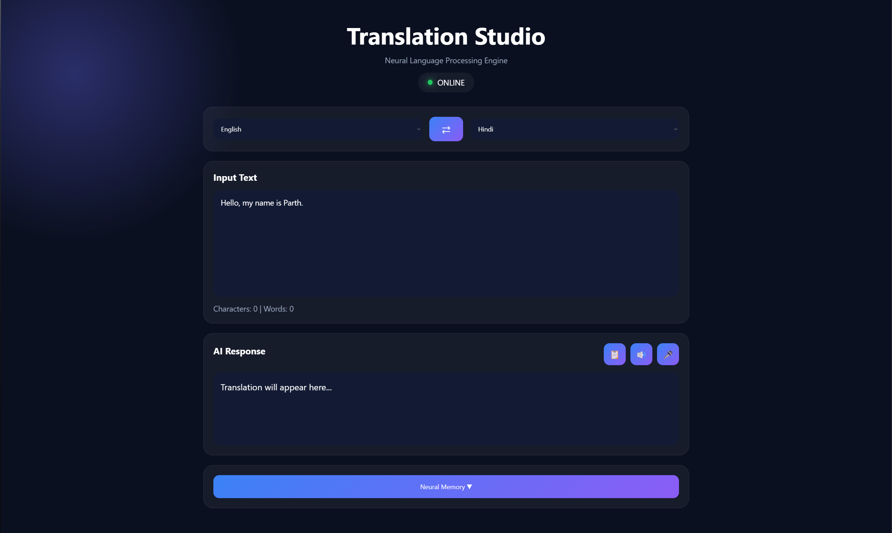
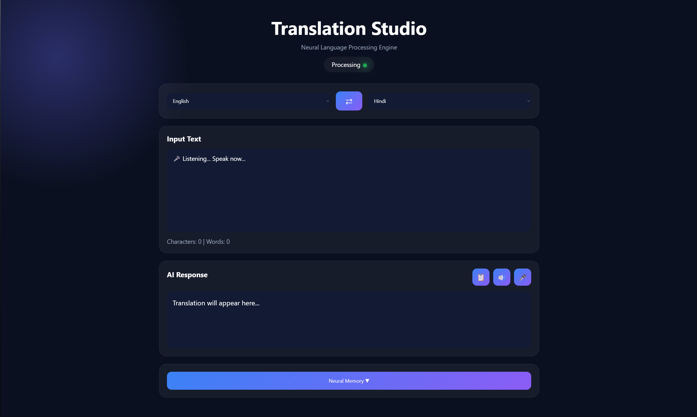
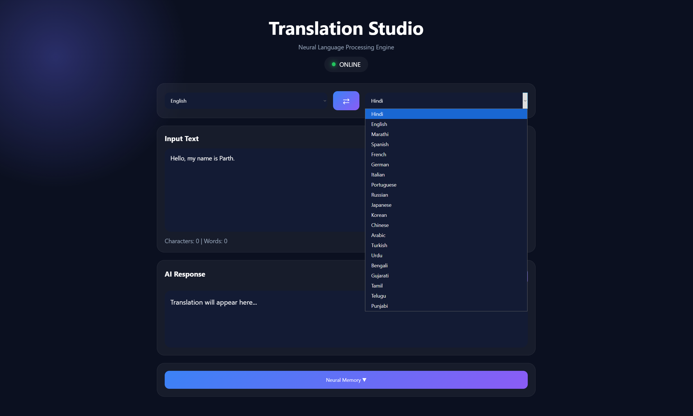
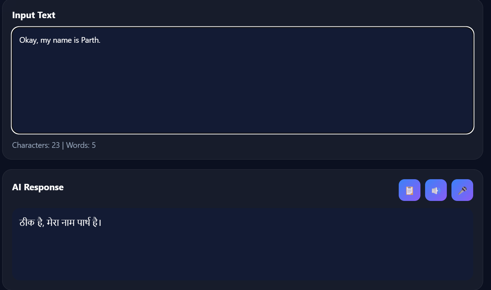
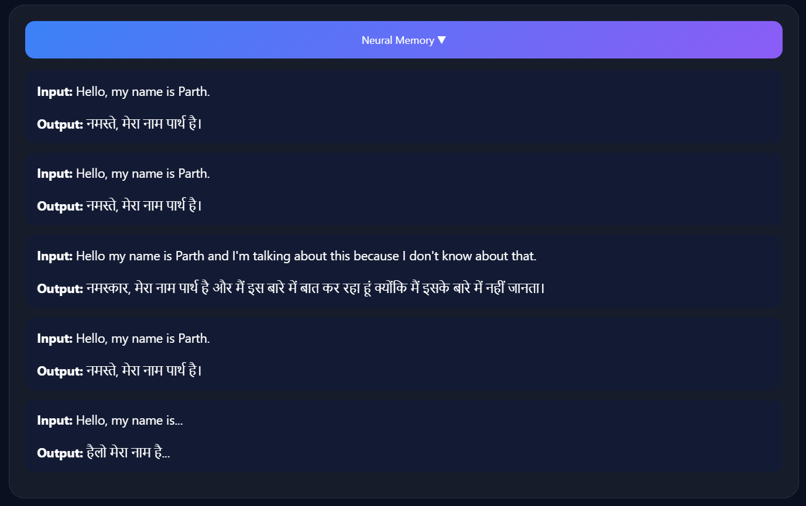

# 🌍 Translation Studio

<div align="center">

### AI-Powered Multilingual Language Translation Studio

**Built with Python • Flask • OpenAI Whisper • Google Translator • gTTS**

</div>

---

## 📖 Overview

Translation Studio is an AI-powered multilingual web application developed as part of the **CodeAlpha Artificial Intelligence Internship**.

The application enables users to translate text and speech between multiple languages using a custom-built Voice Engine powered by OpenAI Whisper, Voice Activity Detection (VAD), and Google Translator.

Unlike traditional translators, Translation Studio automatically detects when the user starts and stops speaking, making voice interaction smooth and natural.

---

# ✨ Features

### 🌐 Language Translation

- Multilingual Text Translation
- Automatic Translation
- Language Swap
- Translation History
- Character Counter
- Word Counter

### 🎤 AI Voice Engine

- Voice Activity Detection (VAD)
- Automatic Speech Start Detection
- Automatic Speech End Detection
- Dynamic Noise Calibration
- Automatic Recording Stop
- Intelligent Silence Filtering

### 🧠 Speech Processing

- OpenAI Whisper Speech-to-Text
- Real-Time Voice Recognition
- Noise Filtering
- Speech Recognition Optimization

### 🔊 Voice Output

- Text-to-Speech
- Multi-language Voice Support

### 🎨 User Interface

- Modern Dark Theme
- Responsive Design
- Animated Status Indicators
- Professional User Experience

---

# 🛠 Technologies Used

- Python
- Flask
- JavaScript
- HTML5
- CSS3
- OpenAI Whisper
- Google Translator (deep-translator)
- gTTS
- Web Audio API
- MediaRecorder API

---

# 📂 Project Structure

```
CodeAlpha_LanguageTranslationTool

│── app.py
│── whisper_model.py
│── requirements.txt
│── history.json
│── README.md

├── audio/
├── static/
│     ├── style.css
│     └── script.js

├── templates/
│     └── index.html
```

---

# 🚀 Installation

Clone the repository

```bash
git clone https://github.com/Parth-Kokitkar/CodeAlpha_LanguageTranslationTool.git
```

Move into the project

```bash
cd CodeAlpha_LanguageTranslationTool
```

Install dependencies

```bash
pip install -r requirements.txt
```

Run the application

```bash
python app.py
```

Open

```
http://127.0.0.1:5000
```

---

# 📸 Application Preview

# 📸 Application Preview

## 🏠 Home Screen



---

## 🎤 Listening Mode


---

## ⚙️ Processing Mode



---

## 🌐 Supported Languages



---

## 🌍 Translation Result



---

## 🧠 Translation History



---

# 🚀 Future Improvements

- AI Conversation Mode
- Offline Translation
- Live Streaming Translation
- Voice Cloning
- Speaker Identification
- Mobile Application
- OCR Image Translation
- Document Translation

---

# 👨‍💻 Author

**Parth Kokitkar**

Artificial Intelligence Student

MIT ADT University

CodeAlpha AI Intern

---

# ⭐ Support

If you like this project, consider giving it a ⭐ on GitHub.

---

<div align="center">

### Built with ❤️ using Artificial Intelligence

</div>